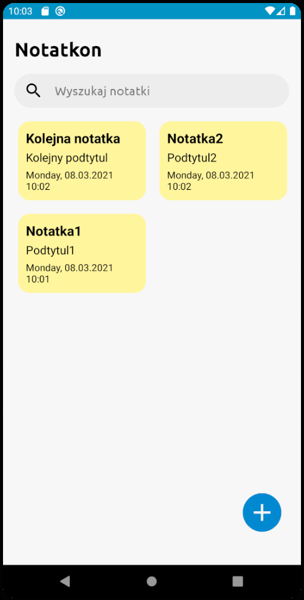
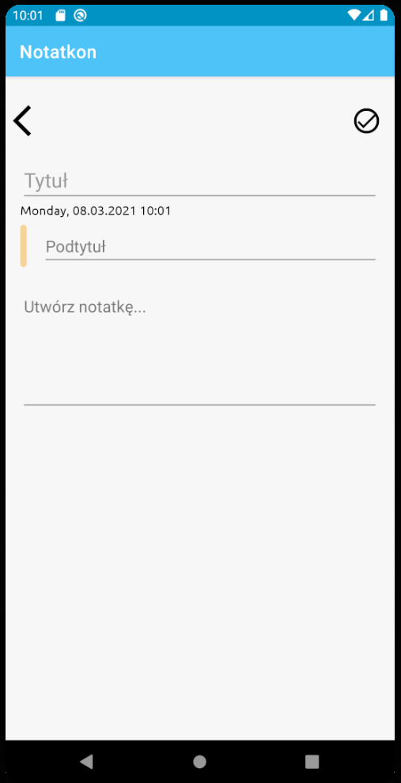
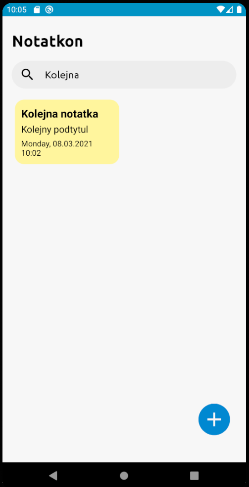
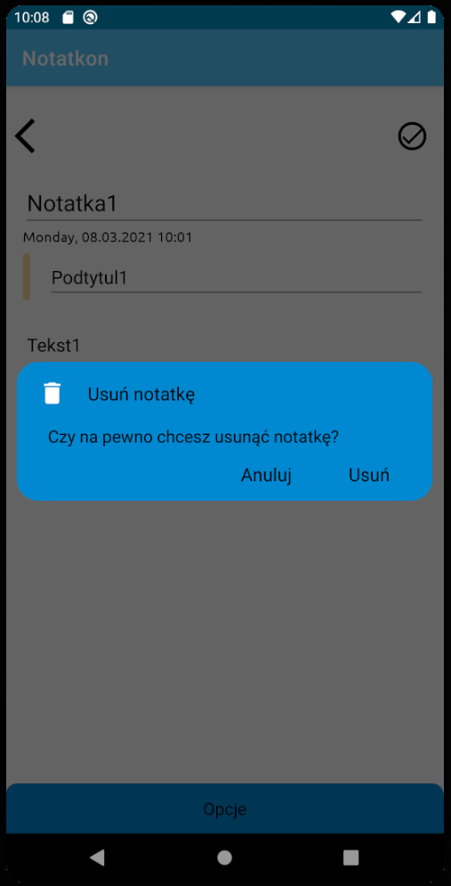

# Notatkon - simple note app

>A simple note taking app inspired by MIUI Notes for android

### Features

* Add note
* Edit note
* Delete note
* Search note by keyword

## Technologies
Project is created with:
* Java 8
* Android Studio
* SQLite (Room library)

      
      
